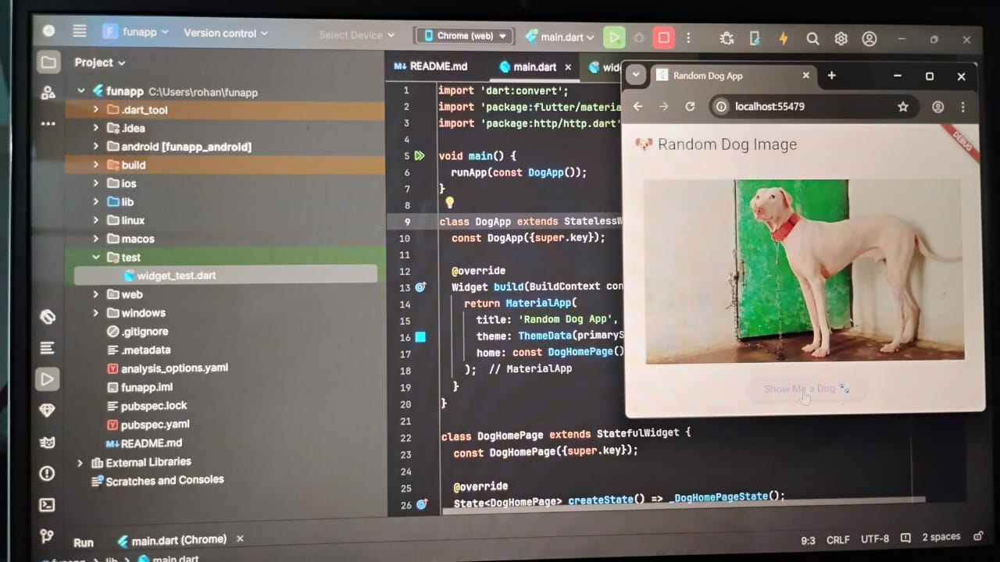
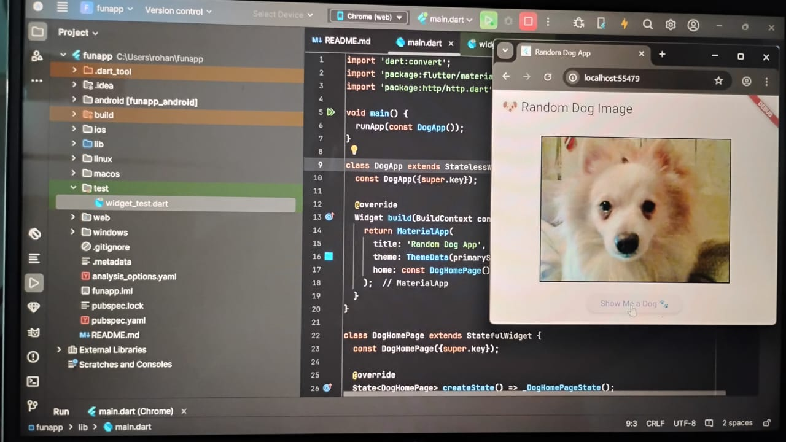

# funapp

A new Flutter project.

## Getting Started

This project is a starting point for a Flutter application.

A few resources to get you started if this is your first Flutter project:

- [Lab: Write your first Flutter app](https://docs.flutter.dev/get-started/codelab)
- [Cookbook: Useful Flutter samples](https://docs.flutter.dev/cookbook)

For help getting started with Flutter development, view the
[online documentation](https://docs.flutter.dev/), which offers tutorials,
samples, guidance on mobile development, and a full API reference.

# 🐶 Random Dog Image App

A fun Flutter app that fetches and displays random dog images using an external API.  
This project demonstrates using third-party packages from **pub.dev**.

## 📦 Package Used
- [http](https://pub.dev/packages/http) → for API requests

## 🚀 Features
- Fetches random dog images from [Dog CEO API](https://dog.ceo/api/breeds/image/random)
- Simple & interactive button to refresh and see new dogs 🐾

## 📸 Screenshot

